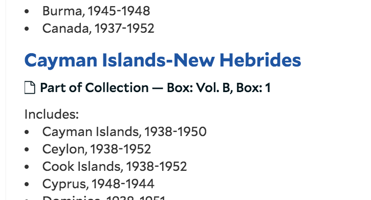
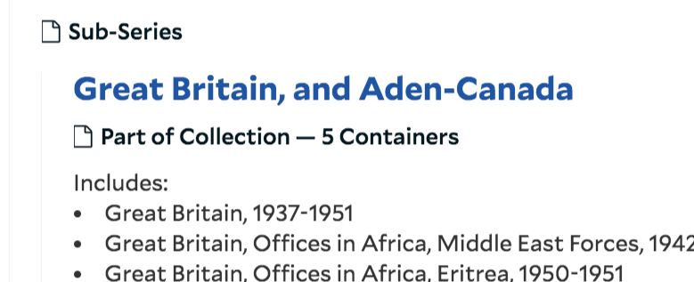

# display_multiple_containers

An plugin to modify how containers are displayed in the ArchivesSpace public user interface (PUI)

## About

This plugin modifies the ArchivesSpace public user interface (PUI) so that if three or fewer containers are associated with a descriptive record title information for all three containers will display in the PUI. If four or more containers are associated with a descriptive record the number of containers will display in the PUI.

The plugin overrides behavior in three files:
* `public/locales/en.yml`: updates 'multiple_containers' enumeration to accept the number of containers as a parameter
* `public/models/record.rb`: updates the `parse_container_display` function in the `Record` class. Moves the multiple containers return statement out of the instance loop to prevent the loop from stopping once the container count is greater than 1. Adds a condition so that if the length of the container list is greater than 1 but less than 4 the function returns a string representation of the container titles. Adds an `elsif` statement so that if the number of containers is 4 or more the function updates and returns the 'multiple_containers' locale with the number of containers.
* `public/views/shared/_present_list.html.erb`: added a line so that the string representation of the container list for multiple containers (less than 4) will display properly - the file looks for a string and then does nothing, since no additional processing is needed as the list has already been converted to a string. This seems a little hacky but was the shortest and easiest way to do it.

## Examples

Display with less than four containers:

Display with more than three containers:

## Requirements

* Tested on ArchivesSpace 2.5.1 and 2.7.0